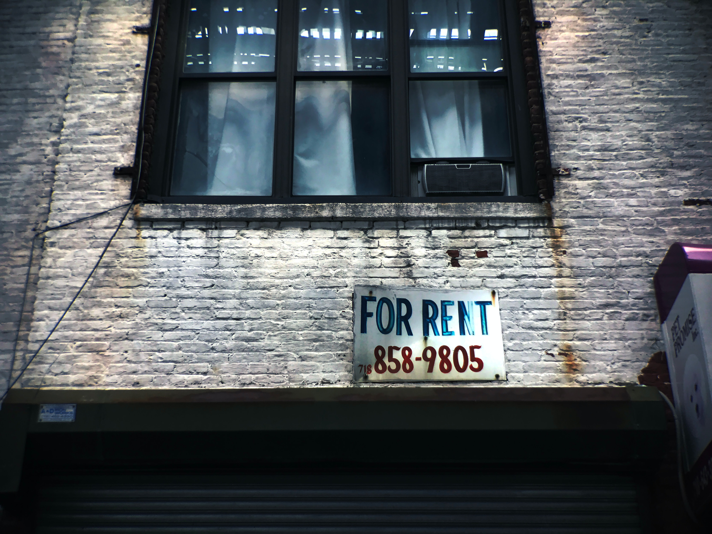

# Inmobiliaria

Photo by <a href="https://unsplash.com/@jd_alon?utm_source=unsplash&amp;utm_medium=referral&amp;utm_content=creditCopyText">Jose Alonso</a> on <a href="https://unsplash.com/s/photos/rental?utm_source=unsplash&amp;utm_medium=referral&amp;utm_content=creditCopyText">Unsplash</a>

## Pre-requisitos
-  React Native
   - Instalar el entorno de desarrollo [**:warning: utiliza la opción React Native CLI Quickstart NO utilizar Expo**](https://reactnative.dev/docs/environment-setup)
- Editor de texto
  - Elegir un editor para codificar, puede ser [Visual Studio Code](https://code.visualstudio.com/), o algúno similar.
  - Agregar la extensión [Prettier](https://marketplace.visualstudio.com/items?itemName=esbenp.prettier-vscode) para mantener un estilo consistente en tu código
  - Instalar [ESLint](https://eslint.org/) para ayudarte a encontrar y arreglar problemas de tu código
  - Agregar la extensión [Eslint](https://marketplace.visualstudio.com/items?itemName=dbaeumer.vscode-eslint) a tu editor para integrar la funcionalidad de Eslint
- Calidad de código. Para analizar la calidad de tu código necesitarás
  - Instalar y configurar [CodeClimate](https://codeclimate.com/) para analizar tu codigo y mejorar la calidad atendiendo los resultados del análisis
  
## Requerimientos funcionales
  
  Una empresa inmobiliaria necesita una App para poder mostrar a sus clientes las propiedades que tiene disponibles en renta. La App mostrar un listado de todas las propiedades disponibles mostrando la siguiente información para cada propiedad:
  - Nombre
  - Dirección
  - Número de habitaciones
  - Número de baños
  - Superficie
  - Costo de renta mensual
  - Evaluación o calificación de la propiedad
  - Icono que permita al usuario indicar o marcar las propiedades que más le gustan
  
## Requerimientos no-funcionales
- Base de datos
  - Los datos se tomarán de manera local en formato JSON, puede ser una archivo, clase o constante 
- Calidad
  - Utilizar un estilo de código estandarizado (revisado por Eslint)
  - Puntuación **A** obtenida en [CodeClimate](https://codeclimate.com/)
- Ejecución 
  - Puede ejecutarse en Android o iOs
- Código fuente
  - Orientado a Objetos
  - Métodos pequeños
  - Aplicar los principios [SOLID](https://blog.usejournal.com/how-to-apply-solid-principles-in-react-applications-6c964091a982)
  

## Tecnologías
- [React Native CLI](https://reactnative.dev/docs/environment-setup)
- [React Native Navigation](https://reactnavigation.org/)
- [Hooks](https://es.reactjs.org/docs/hooks-intro.html)

## Diseño

En la carpeta [img](/img) se encuentra el diseño solicitado en formato PNG y [Figma]().

## Flujo de trabajo sugerido

- Divide tu trabajo en pequeñas tareas
- Para cada pantalla identifica o clasifica los diferentes compones que se presentan
- Inicia programando los componentes individuales procurando que estos sean reutilizables
- Una vez que tienes listos los componentes integra las pantallas.

## Entregable
- Código fuente en Github
- Incluir en el repositorio la puntuación obtenida (badge) en CodeClimate
- [Los commits deben se significativos](https://medium.com/better-programming/you-need-meaningful-commit-messages-d869e44e98d4)

## Recursos 
[Para apoyo de tus actividades utiliza esta lista de recursos recomendados](https://github.com/bright-coders/commons/tree/master/topics/resources-react-native)
  
